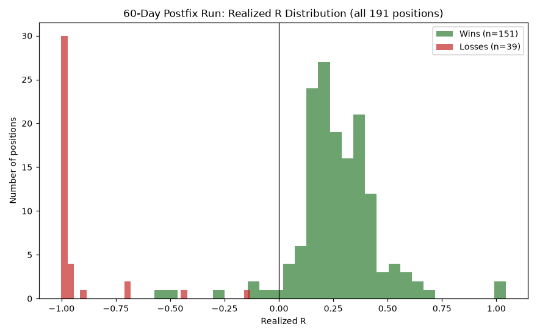
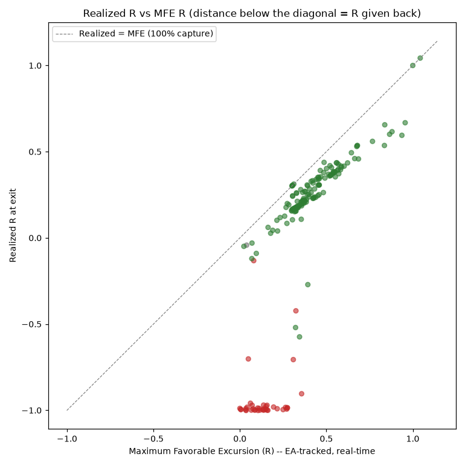
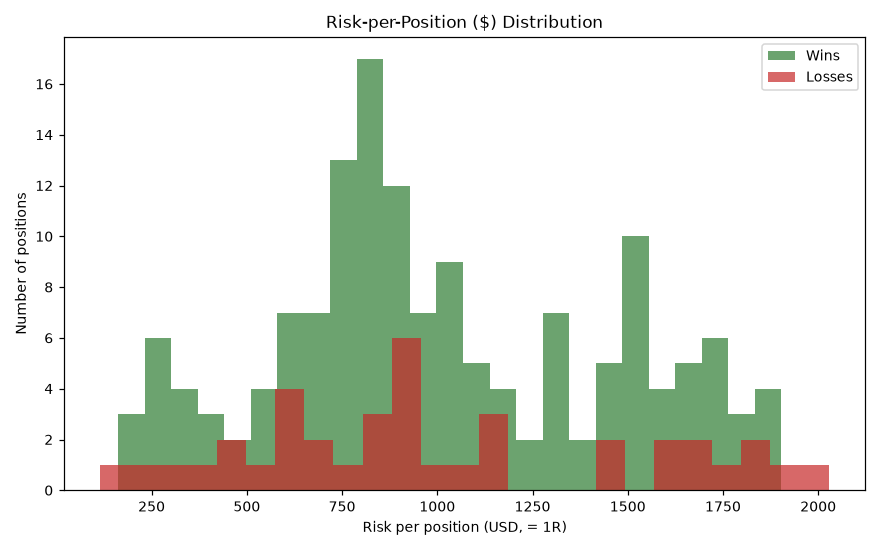
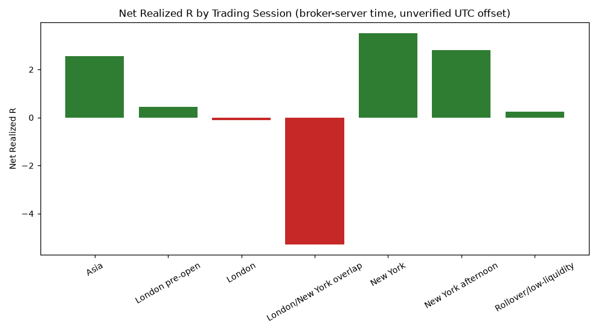
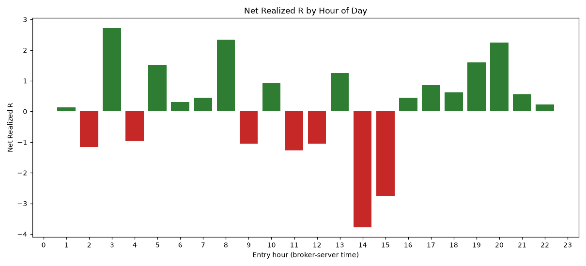

# 60-Day M30-Postfix Trade Behavior -- Executive Report

**Run window:** 2026-05-18 -> 2026-07-17 (broker-server time)  
**EA:** XAUUSD_AI_Sniper_EA_v6.25.5 (internal build string at run time; contains the M30 same-direction-exhaustion trade-frequency fix, later formally released as v6.25.6), EX5 SHA-256 `430f8d11478d2d0a80df89f0baf0daa7a8a94534fad3c3d4b96e7a1bffc80bc9`  
**Branch/commit tested:** `audit/codex-complete-xauaisniper-forensic-repair` / `EA source at time of run corresponds to the trade-frequency fix commit (pre-lifecycle-telemetry); exact commit SHA not separately tagged at run time -- see 60DAY_METHOD_AND_LIMITATIONS.md`  
**Symbol/Period/Model:** XAUUSD / M10 / 4 (real ticks), History Quality 100% real ticks, 24,649,026 ticks, 5,766 M10 bars  
**Deposit/Leverage:** 10,000.00 USD / 1:100  

## Top-level numbers (cross-checked against the tester's own summary)

- Total positions: **191** (151 win, 39 loss, 1 breakeven)
- Total campaigns (real EA-assigned CAMP-N IDs): **153** (119 win, 34 loss)
- Campaigns with at least one pyramid addition: **33** of 153 (21.6%)
- Net realized profit: **$3,524.07**
- Gross profit / Gross loss: $43,272.98 / $-39,748.91
- Profit Factor: **1.09**
- Win rate (positions): **79.1%**

## Average SL / risk per position (owner-requested)

SL distance and risk are set once per position at entry by the EA's own risk-geometry engine (`R_EXIT_ENTRY_CAPTURE_CONFIRMED`), so "1R" below always means the position's own original structural-SL risk, not a fixed constant.

| | All positions | Winners | Losers |
|---|---|---|---|
| Average SL distance (price) | 19.46 | 19.32 | 19.97 |
| Median SL distance (price) | 17.48 | 17.97 | 16.44 |
| Average risk (USD, = 1R) | 1,010.20 | 1,011.39 | 1,013.24 |
| Median risk (USD, = 1R) | 898.62 | 905.22 | 898.00 |
| Smallest / largest SL distance | 7.08 / 86.52 | | |

## Exit authority -- what actually closed each position

`EXTERNAL_CLOSE_BROKER_SL` means the broker's own stop order filled (this is the position's structural SL order -- it can be the ORIGINAL invalidation level, or a level the EA moved up to lock in profit before price reversed and hit it; both are broker-confirmed SL fills, so they are not automatically losses). Every other reason is the EA closing the position itself at market (`EA_MANAGED_CLOSE`) via one of its own exit authorities.

| Exit reason (EA's own classification) | Win | Loss | Breakeven | Total |
|---|---|---|---|---|
| BASKET_FLOOR_TRIGGERED | 53 | 0 | 1 | 54 |
| DIRECTION_EXCLUSIVITY_PROFITABLE_CLOSE_FIRST | 2 | 0 | 0 | 2 |
| EXTERNAL_CLOSE_BROKER_SL | 14 | 39 | 0 | 53 |
| R_EXIT_GIVEBACK_45 | 40 | 0 | 0 | 40 |
| R_EXIT_RUNNER_CONTINUATION_FAILED | 13 | 0 | 0 | 13 |
| R_EXIT_TP_1R | 2 | 0 | 0 | 2 |
| R_PROFIT_GUARANTEE_FLOOR_BREACH | 27 | 0 | 0 | 27 |

- Of the **39 losses**, every single one closed via `EXTERNAL_CLOSE_BROKER_SL` (broker-confirmed structural stop hit). There are 0 losses from any EA-managed close authority.
- 14 positions ALSO hit their broker-side SL order but closed as a WIN -- these are cases where the EA's profit-floor logic had already moved the stop up into profit before price reversed and triggered it.

## Losing trades -- full detail on every single one

All 39 losing positions, in time order. **MFE_R** is the real peak favorable excursion the EA's own R-Exit manager tracked before the loss (i.e. "how much profit did it reach before turning into a loss"); **Time-to-SL** is entry-to-exit hold time.

| Ticket | Campaign | Dir | Entry time | Hold (min) | Risk $ | MFE (R) | MFE ($) | Ever reached +0.20R? | Realized ($) | Realized (R) |
|---|---|---|---|---|---|---|---|---|---|---|
| 8 | CAMP-4 | SELL | 2026-05-18 14:33:00 | 6.4 | 1,057.42 | 0.061 | 64.61 | No | -1,061.97 | -0.959 |
| 10 | CAMP-5 | SELL | 2026-05-18 15:03:00 | 43.0 | 955.20 | 0.134 | 128.40 | No | -959.20 | -0.998 |
| 26 | CAMP-11 | BUY | 2026-05-19 11:03:00 | 25.4 | 1,019.28 | 0.089 | 91.14 | No | -1,019.28 | -0.998 |
| 28 | CAMP-12 | BUY | 2026-05-19 14:03:30 | 123.9 | 894.96 | 0.006 | 4.95 | No | -896.61 | -0.996 |
| 42 | CAMP-17 | BUY | 2026-05-21 21:03:00 | 1,198.8 | 916.65 | 0.036 | 32.97 | No | -917.91 | -1.001 |
| 48 | CAMP-20 | BUY | 2026-05-26 11:03:00 | 89.4 | 898.00 | 0.112 | 100.50 | No | -901.00 | -0.989 |
| 52 | CAMP-22 | SELL | 2026-05-27 07:03:00 | 46.5 | 830.06 | 0.035 | 29.40 | No | -835.94 | -0.990 |
| 68 | CAMP-30 | SELL | 2026-05-29 15:33:00 | 88.8 | 877.27 | 0.309 | 270.84 | Yes | -885.04 | -0.706 |
| 69 | CAMP-30 | SELL | 2026-05-29 15:41:43 | 58.5 | 383.88 | 0.139 | 53.55 | No | -384.09 | -0.999 |
| 90 | CAMP-38 | BUY | 2026-06-03 01:33:00 | 37.9 | 898.38 | 0.071 | 63.63 | No | -913.50 | -0.971 |
| 94 | CAMP-39 | BUY | 2026-06-03 03:41:36 | 20.2 | 219.84 | 0.080 | 17.52 | No | -221.16 | -0.132 |
| 102 | CAMP-42 | SELL | 2026-06-04 04:03:30 | 16.8 | 892.45 | 0.151 | 135.20 | No | -893.75 | -0.977 |
| 108 | CAMP-44 | BUY | 2026-06-04 19:33:30 | 388.8 | 838.75 | 0.216 | 181.50 | Yes | -847.55 | -0.991 |
| 109 | CAMP-44 | BUY | 2026-06-04 22:32:30 | 147.6 | 311.86 | 0.357 | 111.29 | Yes | -338.83 | -0.904 |
| 116 | CAMP-47 | SELL | 2026-06-09 07:33:00 | 59.5 | 756.90 | 0.116 | 87.75 | No | -757.35 | -0.999 |
| 120 | CAMP-49 | SELL | 2026-06-09 10:33:30 | 314.2 | 684.38 | 0.271 | 185.44 | Yes | -687.80 | -0.993 |
| 126 | CAMP-52 | SELL | 2026-06-11 09:33:00 | 88.3 | 641.16 | 0.162 | 103.74 | No | -641.94 | -1.000 |
| 138 | CAMP-57 | SELL | 2026-06-15 09:33:30 | 120.1 | 635.74 | 0.151 | 96.14 | No | -638.78 | -0.994 |
| 164 | CAMP-67 | BUY | 2026-06-16 22:06:41 | 173.3 | 115.50 | 0.049 | 5.70 | No | -143.60 | -0.702 |
| 194 | CAMP-79 | SELL | 2026-06-19 14:03:30 | 109.6 | 1,137.12 | 0.264 | 300.48 | Yes | -1,138.08 | -0.983 |
| 200 | CAMP-82 | BUY | 2026-06-22 04:02:47 | 1,676.3 | 1,124.76 | 0.105 | 118.30 | No | -1,131.13 | -1.001 |
| 210 | CAMP-87 | SELL | 2026-06-25 17:03:00 | 113.4 | 1,170.96 | 0.066 | 77.86 | No | -1,175.38 | -0.999 |
| 229 | CAMP-93 | SELL | 2026-06-29 02:33:37 | 228.8 | 481.36 | 0.250 | 120.12 | Yes | -483.34 | -0.996 |
| 243 | CAMP-97 | SELL | 2026-06-30 15:59:13 | 11.1 | 438.34 | 0.085 | 37.20 | No | -439.58 | -0.999 |
| 284 | CAMP-114 | SELL | 2026-07-03 09:33:00 | 92.8 | 2,027.65 | 0.005 | 9.63 | No | -2,027.65 | -0.995 |
| 290 | CAMP-117 | BUY | 2026-07-06 11:03:00 | 43.3 | 1,930.62 | 0.076 | 146.28 | No | -1,940.28 | -0.992 |
| 292 | CAMP-118 | BUY | 2026-07-06 14:03:00 | 99.8 | 1,736.28 | 0.324 | 561.96 | Yes | -1,740.48 | -0.423 |
| 293 | CAMP-118 | BUY | 2026-07-06 14:20:11 | 70.6 | 559.68 | 0.275 | 154.08 | Yes | -577.92 | -0.986 |
| 297 | CAMP-119 | SELL | 2026-07-07 03:15:10 | 15.2 | 614.94 | 0.195 | 119.88 | No | -614.94 | -0.981 |
| 300 | CAMP-120 | BUY | 2026-07-07 11:33:30 | 55.6 | 1,441.20 | 0.135 | 194.40 | No | -1,443.60 | -0.993 |
| 325 | CAMP-129 | SELL | 2026-07-09 02:52:36 | 19.8 | 607.50 | 0.034 | 20.52 | No | -607.50 | -0.998 |
| 328 | CAMP-130 | SELL | 2026-07-09 04:33:00 | 53.5 | 1,698.80 | 0.042 | 71.24 | No | -1,704.28 | -0.982 |
| 332 | CAMP-132 | SELL | 2026-07-09 14:03:00 | 64.8 | 1,576.50 | 0.274 | 432.00 | Yes | -1,585.50 | -0.985 |
| 350 | CAMP-139 | SELL | 2026-07-14 12:33:30 | 111.3 | 1,813.36 | 0.103 | 186.96 | No | -1,824.00 | -0.987 |
| 362 | CAMP-145 | BUY | 2026-07-15 06:03:30 | 128.1 | 1,822.80 | 0.157 | 286.65 | No | -1,847.79 | -0.971 |
| 364 | CAMP-146 | BUY | 2026-07-15 09:03:30 | 130.2 | 1,634.80 | 0.137 | 224.48 | No | -1,636.02 | -0.970 |
| 374 | CAMP-150 | BUY | 2026-07-15 16:03:13 | 212.0 | 1,660.68 | 0.157 | 261.24 | No | -1,661.94 | -0.999 |
| 379 | CAMP-152 | BUY | 2026-07-16 12:02:41 | 133.6 | 723.52 | 0.148 | 106.76 | No | -724.20 | -0.992 |
| 382 | CAMP-153 | BUY | 2026-07-16 15:33:30 | 7.4 | 1,488.00 | 0.000 | 0.00 | No | -1,500.00 | -0.989 |

### Losing-trade summary statistics

- Average time-to-SL: **164.7 minutes** (median 88.8 min)
- Fastest / slowest loss: 6.4 min / 1,676.3 min
- Average MFE before the eventual loss: **0.138R** ($133.19)  -- median 0.134R
- Losses that were NEVER floating positive (MFE <= 0R, went straight against entry): **1 of 39** (2.6%)
- Losses that reached +0.20R at some point before reversing to the loss: **9 of 39** (23.1%)
- Losses that reached +0.30R: **3** (7.7%)
- Losses that reached +0.50R: **0** (0.0%)
- Average MAE (deepest floating loss reached, including on the losers themselves): **-0.952R** ($-971.52)

## Winning trades -- summary (all 151 real wins + 1 breakeven)

- Average realized profit: **$286.58** (median $247.45)
- Average realized R: **0.270R** (median 0.251R)
- Average MFE reached before exit: **0.427R** (median 0.384R)
- Average MFE capture (realized R / MFE R): **55.5%** (median 64.1%) -- i.e. on average the EA's exit management kept this fraction of the best floating profit each winner ever reached
- Average MAE before eventually winning (real drawdown-before-profit): **-0.294R** ($-295.95)
- Winners that were immediately profitable (MAE within 0.02R of zero, essentially no drawdown before profit): **9 of 151** (6.0%)
- Average hold time: **68.5 min** (median 26.0 min)

## Pyramid contribution

- Core-leg-only reconstructed total: **$5,439.75**
- Pyramid-leg-only total: **$-1,915.68**
- Combined actual total: **$3,524.07**
- Campaigns where the core alone would have been a WIN, but the combined campaign (after pyramid additions) became a LOSS: **4**

## Session and hour performance

*(Session boundaries are broker-server-time buckets; the exact UTC offset of this MetaQuotes-Demo server was not independently confirmed -- see limitations doc.)*

| Session | Positions | Wins | Losses | Win rate | Net R | Net $ |
|---|---|---|---|---|---|---|
| Asia | 49 | 40 | 9 | 81.6% | 2.56 | 3,862.48 |
| London pre-open | 11 | 8 | 2 | 72.7% | 0.44 | 1,367.23 |
| London | 56 | 45 | 11 | 80.4% | -0.10 | -2,046.33 |
| London/New York overlap | 25 | 14 | 11 | 56.0% | -5.27 | -5,186.56 |
| New York | 28 | 25 | 3 | 89.3% | 3.52 | 2,050.56 |
| New York afternoon | 14 | 13 | 1 | 92.9% | 2.82 | 2,494.99 |
| Rollover/low-liquidity | 8 | 6 | 2 | 75.0% | 0.23 | 981.70 |

- Best single hour by net R: **3:00** (2.73R)
- Worst single hour by net R: **14:00** (-3.77R)

## Day-of-week performance

| Day | Positions | Wins | Net R |
|---|---|---|---|
| Monday | 35 | 27 | 1.42 |
| Tuesday | 48 | 38 | -0.95 |
| Wednesday | 42 | 36 | 5.53 |
| Thursday | 42 | 31 | -2.97 |
| Friday | 24 | 19 | 1.19 |

## Charts

## What this data does and does not prove

- All entry/exit prices, times, SL distances, risk, MFE, MAE, R-multiples and exit reasons above come from the EA's own real-time journal logging (`R_EXIT_ENTRY_CAPTURE_CONFIRMED` / `R_EXIT_COUNTERFACTUAL` / `CAMPAIGN_*`) or the MT5 Strategy Tester's own broker-confirmed Deals table -- cross-checked against each other (191/191 positions matched cleanly, 0 unmatched). Nothing here is estimated from candle OHLC or fabricated.
- This is Phase 1 evidence only. No trading-logic, threshold, SL, exit, or pyramid change was made or is being recommended here.
- Market-regime/session-type classification beyond broker-server-time buckets (e.g. trend/range/compression labels) was not attempted in this pass -- see `60DAY_METHOD_AND_LIMITATIONS.md`.
